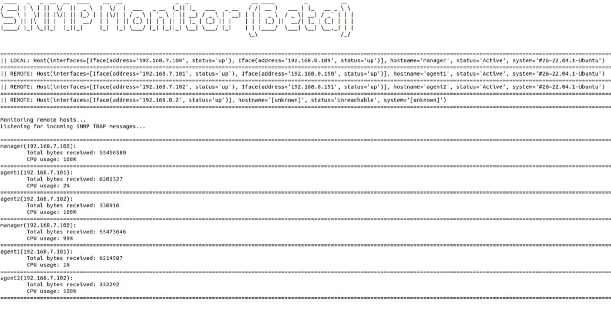

# Средство сетвого мониторинга на базе протокола SNMP

Реализация базовых функций мониторинга:

1) Обнаружение устройств
1) Опрос метрик
1) Прием асихронных оповещений

## Зависимости

1) pysnmp == 0.7.1
1) python-nmap == 2.0.16  
1) netifaces == 0.11.0
1) art == 6.1

## Подготовка к запуску 
### Конфигурация SNMP

*На данном этапе настройку рекомендуется проводить по [документации SNMP](https://net-snmp.org/docs) т.к. в данном руководстве указаны только основные этапы во избежание полного копирования*

Установить пакеты SNMP
```bash
sudo apt update
sudo apt install snmp
```

Отредактировать конфиг-файл 
Задать ```community string``` - строка сообщества (должна быть одинаковой на менеджере и агентах) и ```agent address``` - протокол и порт для соединения
```bash
sudo nano /etc/snmp/snmpd.conf
```

Перезапустить службу SNMP
```bash
sudo systemctl restart snmpd
```

### Конфигурация python-проекта

Склонировать репозиторий в рабочую директорию и установить зависимости
```bash
git clone git@gitwork.ru:kidp/kurs4/2023/dev/2020-3-07-kos.git
pip install -r requirements.txt
```


## Запуск

Перейти в локальный репозиторий и запустить ```main.py```
```bash
cd Path/To/Repo/snmp_monitor
python3 -m main
```

## Примеры работы

1) Обнаружение доступных сетевых устройств


1) Опрос метрик устройств


1) Прием асинхронных сообщений от агентов
